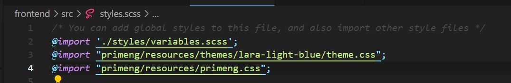
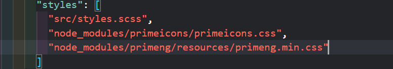

### MINI-SHOP

1. npm install -g @angular/cli
2. npm install primeng
   https://v17.primeng.org/installation  or 20v
3. 
4. npm install primeicons
   

5. run angular app (ng serve) || (npm run start)